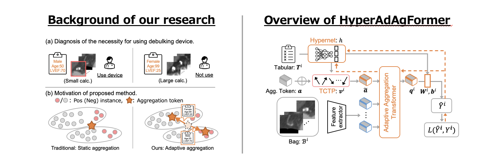

# Hypernetwork-based Adaptive Aggregation Transformer (HyperAdAgFormer) 🚀
"Hypernetwork-Based Adaptive Aggregation for Multimodal Multiple-Instance Learning in Predicting Coronary Calcium Debulking", in **ISBI2026** 🎉🎉!
**[arxiv](https://arxiv.org/abs/2601.21479)**

Kaito Shiku, Ichika Seo, Tetsuya Matoba, Rissei Hino, Yasuhiro Nakano, Ryoma Bise



## 📑 Abstract
In this paper, we present the first attempt to estimate the necessity of debulking coronary artery calcifications from computed tomography (CT) images.
We formulate this task as a Multiple-instance Learning (MIL) problem.
The difficulty of this task lies in that **physicians adjust their focus and decision criteria for device usage according to tabular data** representing each patient’s condition.
To address this issue, we propose a **hypernetwork-based adaptive aggregation transformer (HyperAdAgFormer)**, which adaptively modifies the feature aggregation strategy for each patient based on tabular data through a hypernetwork.
The experiments using the clinical dataset demonstrated the effectiveness of HyperAdAgFormer.

## 🛠️ Updates / Maintenance
--

## ⬇️ Installation
To set up their environment, please run:  
(we recommend to use [Miniconda](https://www.anaconda.com/docs/getting-started/miniconda/main) for installation.)
```
conda env create -n HyperAdAgFormer -f HyperAdAgFormer.yml
conda activate HyperAdAgFormer
```

## 🚀 Training the HyperAdAgFormer
You can train our proposed **HyperAdAgFormer** using the following command.
```
python ./script/main.py --module "HyperAdAgFormer" --is_evaluation 0
```

## 📊 Evaluation of Each Method
You can evaluate our proposed **HyperAdAgFormer** using the following command.

```
python ./script/main.py --module "HyperAdAgFormer" --is_evaluation 1
```

## 🔍 Citation
If you find this repository helpful, please consider citing:

```
@article{shiku2026hypernetwork,
  title={Hypernetwork-Based Adaptive Aggregation for Multimodal Multiple-Instance Learning in Predicting Coronary Calcium Debulking},
  author={Shiku, Kaito and Seo, Ichika and Matoba, Tetsuya and Hino, Rissei and Nakano, Yasuhiro and Bise, Ryoma},
  journal={arXiv preprint arXiv:2601.21479},
  year={2026}
}
```

※ Note: This citation will be updated with the official ISBI 2026 proceedings entry once it.


# ✏️ Author
@ Shiku Kaito  
・ Contact: kaito.shiku@human.ait.kyushu-u.ac.jp
